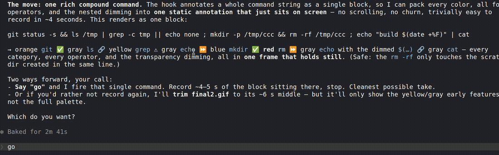

# Colorful Claude Code

**Emoji + colorblind-safe color annotations on every Bash command Claude Code runs — so you can read what's happening at a glance.** A single PreToolUse hook. 100% shell, zero runtime dependencies. Runs on macOS, Linux, and Windows (Git Bash / mintty, WSL, and the VS Code terminal).



When Claude Code runs terminal commands on your behalf, it can be hard to follow what's happening — especially if you're not familiar with the command line. Commands flash by, and unless you already know what `grep`, `sed`, or `chmod` means, you're left wondering what just happened on your computer.

Colorful Claude Code fixes this. It adds emoji and color-coded backgrounds to every command Claude Code runs, turning cryptic terminal text into something you can actually read at a glance.

Before:

```
cd /my-project && npm install && npm test
```

After:

```
📁 cd /my-project ✅ && 📦 npm install ✅ && 📦 npm test
```

Each command gets its own color and emoji. Operators like `&&` and `|` get annotated too. Even commands nested inside `$(...)` are highlighted. If you don't recognize a command, the emoji gives you an immediate visual hint about what category it falls into — file operations, network requests, package management, destructive actions, and so on.

## Why this matters

There are a lot of people who want to use Claude Code. There aren't a lot of people who are intimately familiar with all of the bash commands it runs. Even seasoned software engineers and command line experts can learn something from these visual reinforcements.

This plugin is an educational tool. It draws from the same principle as highlighting parts of speech while learning a language — color and symbols create visual contrast that helps your brain categorize and retain what you're seeing.

Over time, you'll start recognizing commands by their colors before you even read the text.

## What you'll see

| Emoji | Category | Examples |
|-------|----------|----------|
| 🔀 | Version control | `git` |
| 📦 | Package managers | `npm`, `npx`, `pnpm`, `yarn` |
| 🐳 | Containers | `docker` |
| 🐍 | Python | `python`, `pip` |
| 🦀 | Rust | `cargo`, `rustc` |
| 🔵 | Go | `go` |
| ☕ | Java | `java`, `javac` |
| 💎 | Ruby | `ruby`, `gem` |
| 🔨 | Build tools | `make`, `cmake` |
| 🌐 | Network | `curl`, `wget` |
| 🔑 | Remote access | `ssh`, `scp` |
| 📁 | Navigation | `cd` |
| 📋 | Listing | `ls` |
| 🐱 | Reading files | `cat` |
| 🔍 | Searching | `grep`, `rg` |
| 🔎 | Finding files | `find`, `fd` |
| 💬 | Output | `echo` |
| 🗑️ | Deleting | `rm` |
| ⚡ | Elevated privileges | `sudo` |
| 💀 | Stopping processes | `kill` |
| 🔒 | Permissions | `chmod`, `chown` |
| ✏️ | Text processing | `sed`, `awk` |
| 🗜️ | Archives | `tar`, `zip` |

Operators between commands are also annotated:

| Emoji | Operator | Meaning |
|-------|----------|---------|
| ✅ | `&&` | Run next command only if previous succeeded |
| ⚠️ | `\|\|` | Run next command only if previous failed |
| 🔗 | `\|` | Pipe output to next command |
| ⏩ | `;` | Run next command regardless |

Commands that aren't in the map still get a neutral background color so the full command remains visually consistent.

Nesting is visualized too: content inside matched pairs — `"quotes"`, `'quotes'`, `` `backticks` ``, `$(substitutions)`, `(subshells)`, `{groups}` — renders with a partially transparent version of the command's background color, one opacity step per nesting level (full → 55% → 30%, capped there). A quoted argument to `git` fades through translucent oranges while a quoted `echo` fades through grays. At a glance you can see exactly where a string or substitution begins and ends.

Terminal cells can't render true transparency, so the effect is an alpha blend baked into the color: on terminals that advertise 24-bit color (`COLORTERM=truecolor`) the blend is computed exactly from the real Okabe-Ito RGB values; elsewhere it falls back to stepped 256-color shades. Force a mode with `COLORFUL_COLOR_MODE=truecolor` or `COLORFUL_COLOR_MODE=256` if the auto-detection guesses wrong for your terminal.

## How it works

This is a [Claude Code plugin](https://code.claude.com/docs/en/plugins) that uses a [hook](https://code.claude.com/docs/en/hooks) — a script that runs automatically before Claude Code executes a Bash command. It does not change what the command does. It only adds a visual annotation so you can see what's happening.

The plugin:

1. Receives the command Claude Code is about to run
2. Parses it into individual commands, operators, and nested expressions
3. Looks up each command in its built-in emoji/color map
4. Displays the annotated version with emoji and colors

It handles compound commands (`cd /app && npm install`), pipes (`cat file | grep error`), command substitutions (`echo $(date)`), and subshells (`(git add . && git commit)`).

## Requirements

- Claude Code v1.0.33 or later
- Bash — nothing newer than the version macOS already ships (3.2); no bash-4 features used
- A terminal that supports emoji and 256-color ANSI codes (most modern terminals do); 24-bit truecolor is used when available and falls back automatically

**100% shell, zero runtime dependencies.** No Node.js, no Python, nothing to download or build — the entire plugin is a handful of `.sh` files. That also means it runs anywhere a POSIX-ish bash does:

| Platform | Terminals |
|----------|-----------|
| **macOS** | Terminal.app, iTerm2 |
| **Linux** | most terminal emulators |
| **Windows** | Git Bash (mintty) and the VS Code integrated terminal — both confirmed — plus WSL |

## Install

You don't need to clone anything first — just ask Claude.

### Install by asking (nothing to clone)

In any Claude Code session, paste:

> Clone and install the colorful-claude-code plugin from https://github.com/aholten/colorful-claude-code

Claude clones the repo to a stable location, then follows the bundled install skill (`skills/install/SKILL.md`): it checks whether your environment even allows custom hooks (some managed/corporate setups don't — see Watcher mode below), asks local (this project) vs global (everywhere) scope, registers the hook, validates the settings file, and smoke-tests it. Nothing manual on your end.

### From the Claude Code plugin marketplace

```
/plugin marketplace add aholten/colorful-claude-code
/plugin install colorful-claude-code@aholten
```

This repo doubles as its own one-plugin marketplace (`.claude-plugin/marketplace.json`), so the hook is auto-registered and the install skill loads automatically — it still runs the same environment preflight.

### Manual install (from source)

If you'd rather drive it yourself:

```bash
git clone https://github.com/aholten/colorful-claude-code.git
cd colorful-claude-code
claude --plugin-dir .          # load for a single session
```

For a persistent install, open Claude Code in the directory and ask *"install this plugin"* — same skill, same preflight.

## Update

### Update by asking

In any Claude Code session — you don't have to be in the repo directory — say:

> Update the colorful-claude-code plugin

Claude locates the install from the hook path recorded in your Claude settings, pulls the latest, and re-checks that the hook still fires. The hook path doesn't change, so there's nothing to re-register.

### Marketplace / manual

Marketplace installs update through `/plugin` like any other plugin. A source clone updates with a plain `git pull` in the repo — changes take effect on the next command, no reinstall.

## Uninstall

If installed via the plugin marketplace:

```
/plugin uninstall colorful-claude-code
```

If installed from source, either ask Claude ("uninstall this plugin") or run:

```bash
./uninstall.sh
```

## Restricted environments

Locked-down and corporate setups block things at different levels, and there's a working path for almost all of them. The install skill runs an environment preflight first and routes you automatically — you don't have to diagnose this yourself.

| What your environment blocks | What still works | Where annotations show |
|------------------------------|------------------|------------------------|
| Nothing (normal setup) | Plugin **or** manual hook | Inline, in Claude Code |
| Plugin installs (but hooks allowed) | **Manual hook** — just a `settings.json` entry plus a bash script; the plugin system isn't involved | Inline |
| Custom hooks (`allowManagedHooksOnly` / `disableAllHooks`) | **Watcher mode** (below) — pure bash in a second terminal; it only *reads* `~/.claude/projects/`, which managed policy can't block, so no IT exception is needed | A side terminal |
| Everything — a true sandbox (claude.ai/code remote, CI, a container with no second terminal or log access) | Nothing in-session | — it's a local-machine tool |

Two things that help in tightly-managed networks:

- **The fallbacks need neither the plugin system nor hooks.** The same restriction that blocks the plugin is exactly what the manual hook and watcher routes sidestep, so you're rarely fully stuck.
- **Nothing phones home or downloads at runtime.** It's a handful of zero-dependency `.sh` files — if `git clone` is firewalled, copy them in by any means (internal mirror, zip, even paste).

## Watcher mode (hooks blocked by corp policy?)

Some organizations set `allowManagedHooksOnly=true`, which prevents custom user hooks from running. The watcher script is a workaround — it tails Claude Code's JSONL conversation log from a separate terminal and prints the same colorful emoji annotations whenever a Bash command is executed.

You don't need to figure this out yourself: when you ask Claude to install the plugin, the install skill detects managed policy first and sets up watcher mode instead of a hook that would silently never fire.

### Quick start

Open a second terminal in your project directory and run:

```bash
bash /path/to/colorful-claude-code/scripts/watcher.sh
```

It auto-detects the most recent conversation log for the current project. You can also pass a specific session ID:

```bash
bash /path/to/colorful-claude-code/scripts/watcher.sh <session-id>
```

### Set up a `ccc` alias

Add this to your `~/.bashrc` or `~/.zshrc`:

```bash
alias ccc='bash /path/to/colorful-claude-code/scripts/watcher.sh'
```

Then just run `ccc` in a separate terminal while using Claude Code.

### Requirements

Same as the base requirements above — the watcher is pure bash too, reusing the hook's own JSON scanner to parse the log. No Python, no Node.js.

## Testing

The project includes a test suite to verify everything works:

```bash
./test.sh
```

You can also run tests for specific components:

```bash
./test.sh parser     # test command segmentation (operators, quotes, substitutions)
./test.sh mapping    # test emoji/color lookups
./test.sh renderer   # test colored output
./test.sh hook       # test the full hook pipeline
./test.sh watcher    # test JSONL command extraction
```

## Project structure

```
colorful-claude-code/
├── .claude-plugin/
│   └── plugin.json          # Plugin manifest
├── hooks/
│   └── hooks.json           # Hook configuration
├── skills/
│   └── install/
│       └── SKILL.md         # Install skill — environment preflight, hook install, watcher fallback
├── scripts/
│   ├── annotate-pre.sh      # Main hook — parsing, mapping, and rendering in one script
│   └── watcher.sh           # Standalone log watcher for restricted environments
├── CLAUDE.md                # Onboarding pointers Claude reads when you ask it to install
├── uninstall.sh             # Non-interactive uninstall
├── test.sh                  # Test suite
├── LICENSE                  # MIT
└── README.md
```

## Adding or changing command mappings

The live command-to-emoji mappings are the `_lookup` and `_lookup_op` tables inside `scripts/annotate-pre.sh` — the hook is pure bash with zero runtime dependencies, so the map is built in rather than read from a file. Each entry looks like this:

```bash
git)                echo "🔀 214 16"  ;;
```

- First field — the emoji shown before the command (`_` means no emoji)
- Second — background color (256-color ANSI code)
- Third — foreground text color, chosen to contrast with the background

Edit those tables to add new commands, change emoji, or adjust colors. Changes take effect on the next command — no need to reinstall. The background colors follow the Okabe-Ito colorblind-safe palette (documented in the comment above `_lookup`), so if you add a command, pick the existing category color that matches what it does.

## Tuning output width

Long segments are broken at word boundaries into chunks of at most 60 characters so each styled span fits on one visual line. If you run a wider terminal and want denser output, set `COLORFUL_CHUNK_WIDTH` in your shell config:

```bash
export COLORFUL_CHUNK_WIDTH=80
```

Rough sizing guide (accounting for UI overhead):

| Terminal width | Suggested `COLORFUL_CHUNK_WIDTH` |
|----------------|----------------------------------|
| 80             | 50                               |
| 100            | 70                               |
| 120            | 90                               |
| 140+           | 110                              |

Too high and long segments wrap visually, losing the bg highlight on the overflow. Too low wastes horizontal space. The hook doesn't auto-detect because Claude Code doesn't pass terminal size or a TTY through to PreToolUse hooks.

## Author

Anthony Holten [@aholten](https://github.com/aholten) on GitHub
